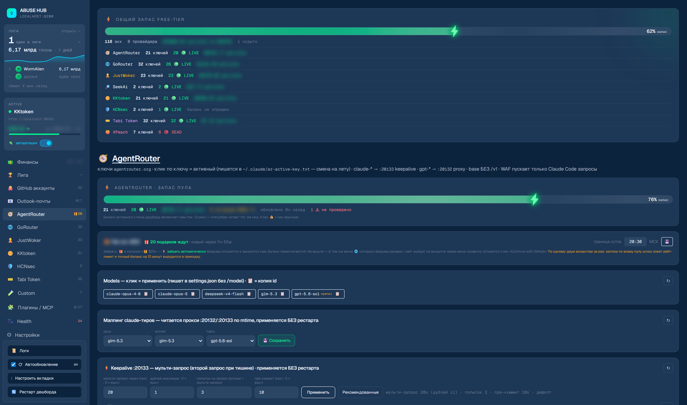
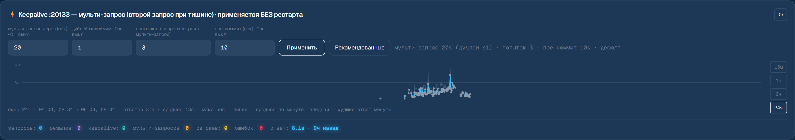
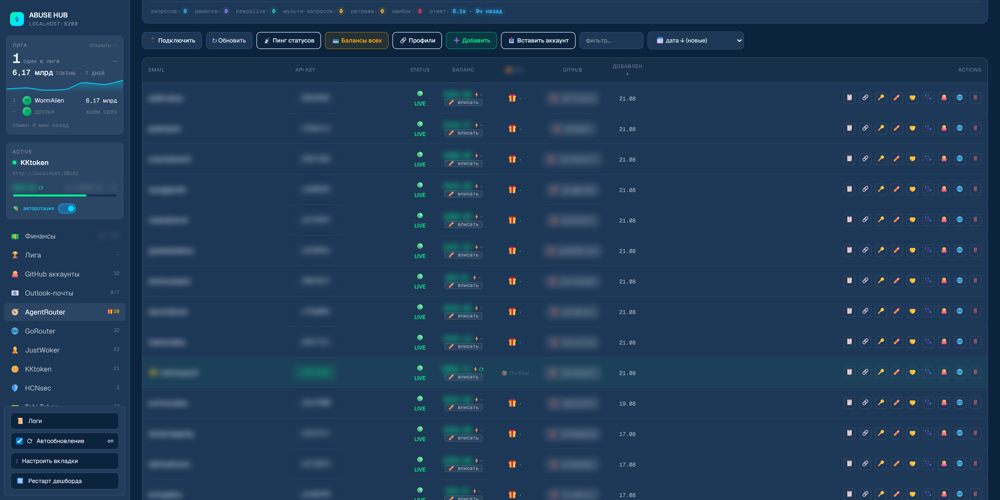
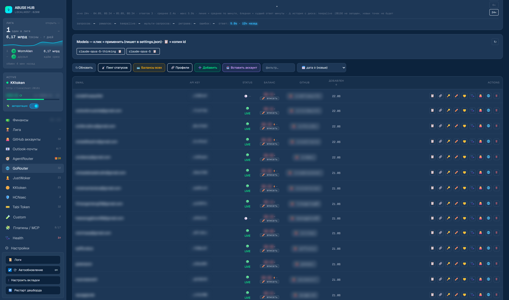
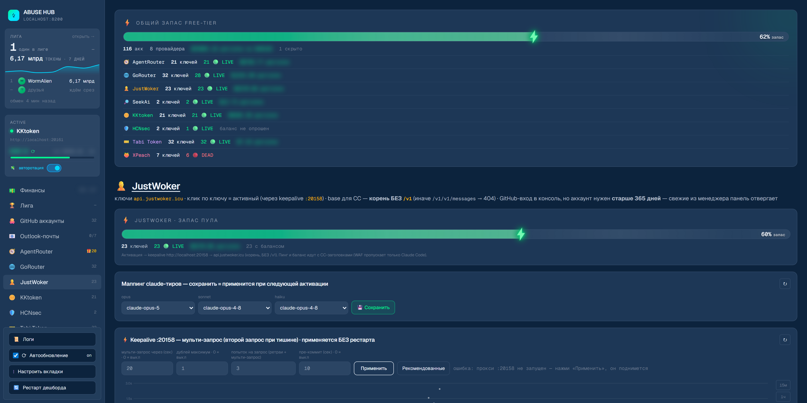
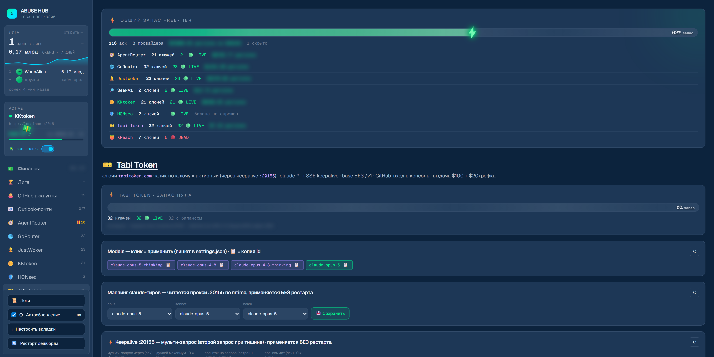
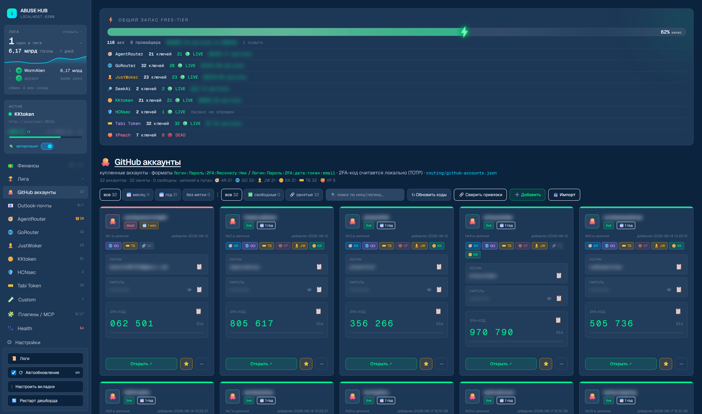
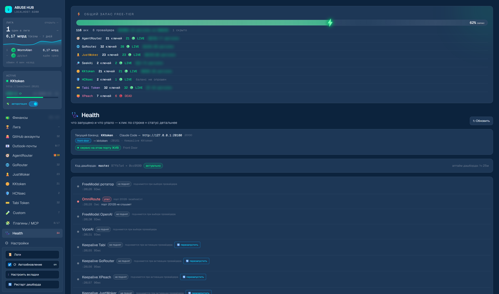
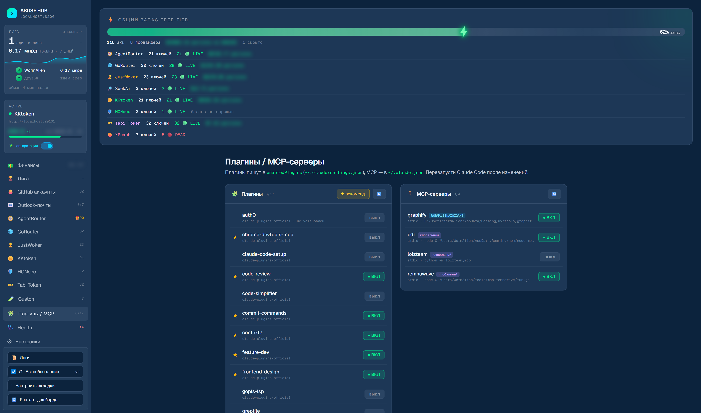
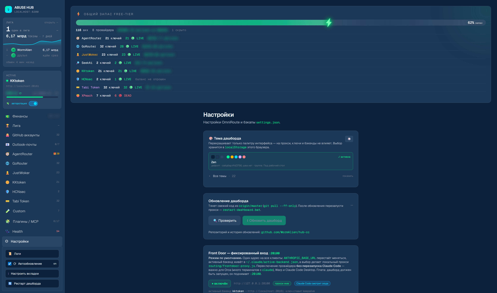

<div align="center">

<a href="https://t.me/xgateonline_bot?start=abusehub"></a>

[](https://t.me/xgateonline_bot?start=abusehub)
[](https://cabinet.xgate.online)
[](https://t.me/xgateonline_bot?start=abusehub)

<sub>Проект бесплатный и живёт с подписок <b>XGATE</b>: свои ноды, IP без истории абуза — регистрации, капчи и API проходят. Триал <b>3 дня бесплатно</b> кнопкой в боте, промокод <code>ABUSEHUB</code> добавляет ещё <b>+3 дня</b> поверх — дальше от 150 ₽/мес.<br>
🤖 <a href="https://t.me/xgateonline_bot?start=abusehub"><b>Telegram-бот @xgateonline_bot</b></a> · 🔑 <a href="https://cabinet.xgate.online"><b>Личный кабинет cabinet.xgate.online</b></a> · <a href="#поддержать-проект">зачем это в репозитории</a></sub>

<br>


# ABUSE HUB

Локальный пульт для Claude Code: один фиксированный адрес для всех клиентов, переключение LLM-шлюза одним кликом из веб-дашборда, пулы ключей с живым балансом, GitHub-аккаунты с TOTP и статус-лайн в CLI.

[](#windows)
[](#macos)
[](#license)

<sub>⚡ <b>Ставится одной строкой на голую машину</b> — <a href="#windows">Windows (PowerShell)</a> · <a href="#macos">macOS (Терминал)</a>. Вставил, пожал Enter — дашборд открылся.</sub>

<br>


<sub>Скриншоты сняты живьём в теме <b>Zen</b> — она же дефолтная, свежая установка выглядит так же. Персональное — метки аккаунтов, e-mail, ники GitHub и любые суммы — на кадрах <b>заблюрено</b>. Ключи шлюзов сам UI показывает только хвостом; целиком по 👁 раскрываются лишь ключи видео/картинко-провайдеров и креды GitHub — дашборд локальный, это осознанно. Снимает <code>tools/render-readme-shots.js</code>, там же список кадров и правила маскировки.</sub>

<br>

</div>

## Что это

Веб-дашборд на `:8200` (`routing/transparent-proxy.js`), который переписывает `~/.claude/settings.json`, держит пулы ключей и поднимает локальные прокси. UI — `/__switch`, HTTP API — `/__switch/api/*`.

Адрес у Claude Code один и навсегда — **`http://127.0.0.1:20100`** (front-door, `routing/frontdoor-proxy.js`, режим по умолчанию). Вбиваешь его один раз в любой клиент — терминал, Warp, Orca, Claude Code Desktop → Third-Party Inference — и больше не трогаешь: активный бэкенд лежит в `~/.claude/active-backend.json`, дашборд меняет только его. Переключение шлюза **не требует перезапуска ни одной сессии**, что критично для Orca (несколько pty с `claude` сразу). Реальный ключ во внешний клиент не нужен (`ANTHROPIC_AUTH_TOKEN=dummy`) — его подставляет прокси. Плата: пока режим включён, дашборд должен быть запущен, он и поднимает `:20100`. Тумблер и адрес для копирования — вкладка «Настройки», разбор устройства — [`ARCHITECTURE.md`](ARCHITECTURE.md#front-door-20100--переключение-провайдера-без-рестарта-claude-code).

Четыре денежных шлюза — **AgentRouter**, **GoRouter**, **JustWoker**, **Tabi Token** — ходят через локальные **SSE keepalive-прокси** (`routing/keepalive-proxy.js`): они держат SSE-поток на паузах thinking-моделей, режут `[1m]`-суффиксы моделей и умеют fallback для `count_tokens`. WAF AgentRouter пускает только «настоящие» запросы Claude Code, поэтому ключ никогда не уезжает в `settings.json`: он лежит в `~/.claude/<префикс>-active-key.txt` и подставляется прокси на каждый запрос — смена активного ключа работает без рестарта CC.

Баланс считается не на глазок. Точная цифра берётся из `/api/user/self` панели куками профиля браузера (`balanceSource: self`); если куки не привязаны — показывается **анкер**, вписанный руками кнопкой **✏️ вписать** (из него вычитается расход); и только когда нет ни того, ни другого, включается прикидка `выдача + бонусы − расход`. Источник видно бейджем в строке: ⚡ точный · ✏️ вручную · `~` прикидка. Расход везде — `GET /dashboard/billing/usage` (центы), кеш — в `routing/*-sessions.json`.

Тумблер **💸 авторотация** в сайдбаре — один на все денежные шлюзы. Реагирует не на порог баланса, а на отказ шлюза «нет баланса»: активный ключ подменяется на следующий пригодный (кандидат — самый маленький баланс, которому хватает). Журнал подмен — карточка на вкладке шлюза, живёт в памяти процесса и после рестарта пуст.

Статус-лайн Claude Code (`routing/statusline-autoreger.sh`) показывает внизу CLI живой баланс активного ключа (`$`) и контекстное окно (`⧉`), при устаревшем кеше сам дёргает рефреш через дашборд. Установщик подключает его сам; на готовой установке — `node tools/enable-statusline.js` и перезапуск `claude`.

На **macOS** работает всё, что нужно для своих аккаунтов: точный баланс (своя схема расшифровки куки Chromium), статус-лайн, ЛК в браузере, переключение бэкендов, OAuth официального Claude. **Не портированы** автореги (Camoufox) и ТГ-пульт — они Windows-специфичны. Детали и диагностика — [`docs/MAC-SETUP.md`](docs/MAC-SETUP.md).

<div align="center">

### Что видно из коробки

| Вкладка | Что делает |
| :--- | :--- |
| **Claude Code** | Активный маршрут из `settings.json` (имя · режим · base URL) + подключение официального Claude по OAuth. |
| **AgentRouter** | Пул ключей `agentrouter.org`. `claude-*` → keepalive `:20133`, `gpt-*` → конвертер `:20132`. Шкала запаса пула, карточка чек-ина **+$25**, маппинг claude-тиров, настройка keepalive с графиком латентности. |
| **GoRouter** | Пул ключей `gorouter.app` через keepalive `:20156`. База прикидки `GO_DEFAULT_GRANT = 70`, шаг `$25`. Чек-ина нет. |
| **JustWoker** | Пул ключей `api.justwoker.icu` через keepalive `:20158`. В каталоге только opus. ⚠️ Регистрация — **только GitHub старше 365 дней**. |
| **Tabi Token** | Пул ключей `tabitoken.com` через keepalive `:20155`. Выдача `$100`, `+$20` рефереру за приведённого. |
| **GitHub аккаунты** | Хранилище аккаунтов: логин/пароль/2FA-секрет/recovery/ник. **TOTP считается локально в браузере** (RFC 6238), профиль браузера на аккаунт, фильтры по возрасту и занятости, плашки «в каком шлюзе уже израсходован». |
| **Telegram аккаунты** | Пул авторегов (`freemodel/tg_pool.json`): статус, health-чек пачкой, «свободен для» по сервисам, импорт `.session` и hex-строк. |
| **Custom** | Свои OpenAI-совместимые провайдеры: конвертер поднимается на активацию в диапазоне `20150–20250`. |
| **SuperGrok** | Сессии grok.com, запуск браузера и терминала под аккаунт. |
| **Health** | Куда реально смотрит Claude Code (включая цепочку front-door → бэкенд → порт), git-состояние репо, аптайм, сервисы по портам с кнопками «перезапустить» и «убить». |
| **Плагины / MCP / Скиллы** | Тоггл `enabledPlugins` из `~/.claude/settings.json`, MCP-серверов из `~/.claude.json` и скиллов через `skillOverrides`, кнопка «★ рекомендованные». |
| **Настройки** | Тема (22 штуки), обновление дашборда, front-door `:20100`, тоггл статус-бара и автокомпакта, JSON-редактор `settings.json` с бэкапами, env OmniRoute. |

</div>

Ровно эти 12 вкладок видны на свежей установке — остальное скрыто по умолчанию. Порядок и видимость — кнопка **⋮ Настроить вкладки** (перетаскивание + глазок), выбор хранится в `localStorage`.


<details>
<summary><b>Легаси — 16 вкладок, не развиваются</b> (11 скрыты по умолчанию + 5 в архивной группе «Чтим память»)</summary>

<br>

Код и данные не удалены, вкладки включаются через **⋮ Настроить вкладки**. Разбор — в [`ARCHITECTURE.md`](ARCHITECTURE.md).

| Модуль | Статус |
| :--- | :--- |
| **VyceAI** | OpenAI-совместимый пул через прокси `:20131`. 🪤 Прокси поднимают только скрипты `restart-dashboard`, активация вкладки его не спавнит — если порт лежит, «Подключить» уведёт клиент в мёртвый адрес. |
| **Aerolink · Evomap · Conduit · Svrtr · HelpCoder** | Ручные пулы ключей через `apiKeyHelper` + `*-active-key.txt`. |
| **Cun** | Пул ключей `cun.ai` через `AUTH_TOKEN`. |
| **Ourtoken** | Пул ключей; кнопка «Подключить» ведёт в OmniRoute `:20128` — внешний Docker, без него активация бесполезна. |
| **AnyModel** | Автореги сторонних моделей. |
| **Video API · Картинки API** | CRUD-хранилища ключей провайдеров (NanoBanana, fal, Replicate, Imagen…). Обёрток под сами провайдеры нет. |
| **XPeach** *(архив)* | Похоронен как шлюз: все ключи `403 banned`, регистрация не проходит. Код, пул, прокси `:20157` и шкала в статуслайне живые. |
| **FreeModel** *(архив)* | Автореги свёрнуты, аккаунты и ротатор `:20126` остались на месте; шкала квот 5h/7d в статуслайне работает. |
| **TokenRouter** *(архив)* | Аккаунты на диске; импорт и удаление требуют живого OmniRoute `:20128`. |
| **Devin · Notion** *(архив)* | Хранилища сессий. У Notion нет своего сервера в репо: `:8190` — это внешний дашборд, к которому ходит CLI. |
| **Telegram-пульт** (`tgbot/`) | Не вкладка, а бот: переключение бэкендов с телефона + живая claude-сессия. Команды `/menu`, `/status`, `/backends`, `/cd`, `/pwd`, `/new`, `/stop`. Запуск `npm run tgbot`. |

</details>

Шлюз тормозит или рвёт поток? Настройка SSE-прокси (мульти-запрос / пинги / пре-коммит) и диагностика «кто виноват» — [`routing/KEEPALIVE-TUNING.md`](routing/KEEPALIVE-TUNING.md).

## Сервисы и порты

| Порт | Сервис | Файл |
| :--- | :--- | :--- |
| `20100` | **front-door** — единственный адрес для Claude Code, режим по умолчанию | `routing/frontdoor-proxy.js` |
| `8200` | **Dashboard** — UI `/__switch` + все `/__switch/api/*` | `routing/transparent-proxy.js` |
| `20133` | **AgentRouter keepalive** (SSE, `claude-*`) | `routing/keepalive-proxy.js` |
| `20132` | **AgentRouter proxy** (`gpt-*`, Anthropic→OpenAI конвертер) | `routing/agentrouter-proxy.js` |
| `20155` | **Tabi Token keepalive** (SSE) | `routing/keepalive-proxy.js` |
| `20156` | **GoRouter keepalive** (SSE) | `routing/keepalive-proxy.js` |
| `20158` | **JustWoker keepalive** (SSE, апстрим — корень `api.justwoker.icu`, без `/v1`) | `routing/keepalive-proxy.js` |
| `20157` | XPeach keepalive (SSE; вкладка в архиве, прокси живой) | `routing/keepalive-proxy.js` |
| `20150–20250` | **Custom OpenAI proxies** — свободный порт из диапазона, поднимается на активацию | `routing/custom-openai-proxy.js` |
| `20126` | FreeModel Key Rotator *(легаси)* | `routing/freemodel-rotator.js` |
| `20130` | FreeModel OpenAI Proxy *(легаси)* | `routing/freemodel-openai-proxy.js` |
| `20131` | VyceAI OpenAI Proxy *(легаси)* | `routing/vyceai-openai-proxy.js` |
| `20128` | OmniRoute (внешний Docker, опц., *архив*) | docker `ghcr.io/diegosouzapw/omniroute` |
| — | **Telegram-пульт** — long-poll, порт не слушает | `tgbot/bot.js` |

🪤 **`20126` / `20130` / `20131` поднимает только хаб** (`HUB.bat` / `HUB.command`, он же `node hub.js start`), вкладки их не спавнят. Активация VyceAI просто прописывает base URL `:20131` — если процесса нет, клиент упрётся в закрытый порт. Проверить одной командой: `node hub.js status`.

---

## Установка с нуля

### Windows

Голый Windows, где **нет ни git, ни node** — открой **PowerShell** (есть в любой Windows) и вставь одну строку. Bootstrap сам поставит Git + Node.js через winget, склонирует репо и запустит интерактивный установщик.

```powershell
irm https://raw.githubusercontent.com/WormAlien/hub-cc/master/install.ps1 | iex
```

> [!NOTE]
> Если после установки Git появилась ошибка про `bash` — закрой это окно PowerShell, **открой новое** и вставь строку ещё раз (PATH обновляется только в новой сессии). Со второго запуска git/node уже на месте, дойдёт до конца.

### macOS

Голый мак, где нет вообще ничего — открой **Терминал** и вставь **одну строку**. Дальше только Enter: bootstrap ставит Command Line Tools (в них git), клонирует репо и прогоняет `install-mac.sh` — Homebrew → node → `npm install` → Playwright chromium → Claude Code → конфиги из `*.example` → дашборд.

```bash
/bin/bash -c "$(curl -fsSL https://raw.githubusercontent.com/WormAlien/hub-cc/master/install-mac.sh)"
```

Хочешь в свою папку — задай `HUBCC_DIR` (сама папка станет корнем репо, промежуточные создадутся):

```bash
HUBCC_DIR="$HOME/Documents/AbuseHub" /bin/bash -c "$(curl -fsSL https://raw.githubusercontent.com/WormAlien/hub-cc/master/install-mac.sh)"
```

Проверено на чистом MacBook: одна вставка, дальше Enter. Реагировать надо в трёх местах:

1. **Окно «Установить инструменты разработчика»** → **Установить**, подождать 5–10 минут, вернуться в Терминал и нажать **Enter** (скрипт ждёт именно этого).
2. **Пароль от мака** — просит установщик Homebrew через `sudo`. Вводится слепо, символы не показываются — это нормально.
3. **«Терминал» запрашивает доступ к папке «Документы»** (только если ставишь в `Documents`) → **OK**. Промахнулся и нажал «Запретить» — *Системные настройки → Конфиденциальность и безопасность → Файлы и папки → Терминал*.

> [!IMPORTANT]
> Именно `/bin/bash -c "$(curl …)"`, а не `curl … | bash`. При пайпе stdin занят самим скриптом, и интерактивные вопросы читают тело скрипта вместо твоего ответа. Так же бутстрапится сам Homebrew.

> [!NOTE]
> Папку `Documents` писать латиницей, хотя Finder показывает «Документы» — на диске она английская.

Дальше запуск в любой момент: двойной клик на **`HUB.command`** в корне репо (меню: старт, стоп, рестарт, обновление) либо `node hub.js start`. `DASHBOARD.command` — тот же старт без меню. Дашборд: <http://localhost:8200/__switch>

### Если git и node уже стоят

Windows (git-bash):

```bash
git clone https://github.com/WormAlien/hub-cc.git
cd hub-cc
bash install.sh
```

macOS — то же, но `bash install-mac.sh`.

Установщик спрашивает только там, где без ответа нельзя (winget — если нет node/git · git identity — если не настроен · доп. зависимости · запустить дашборд). Что он делает:

1. Проверяет `node`/`npm`/`git`, при нехватке предлагает поставить через `winget`.
2. Настраивает git identity и `credential.helper` (без них `git pull` падает на merge-коммите).
3. Дописывает `Git\usr\bin` в user-PATH, если `cat` не виден из cmd — иначе `apiKeyHelper` молча отдаёт пустой ключ и Claude Code пишет «Authentication failed».
4. `npm install` + `npx playwright install chromium chromium-headless-shell`.
5. Ставит **Claude Code**, если его нет. Уже установленную версию не трогает (пин не нужен; если зачем-то нужна конкретная — `CLAUDE_CODE_VERSION=2.1.153 bash install.sh`).
6. Создаёт `~/.claude/settings.json` из шаблона (если ещё нет) и подключает статуслайн.
7. Копирует локальные конфиги из `*.example` (`routing/.env`, `al-sessions`, `video-keys`, `image-keys`, `tgbot/.env`).
8. Зовёт `install-deps.sh` — тяжёлое и опциональное: Python-стек (Camoufox-автореги, grok-launcher, venv для ✈ Открыть TG), `sqlite3.exe`, **OmniRoute** в Docker на `:20128`, `.env` ТГ-бота. Запускается и отдельно: `bash install-deps.sh`.
9. Запускает дашборд и печатает шпаргалку.

> [!NOTE]
> API-ключи и токены установщик **не спрашивает**: в терминале секрет остаётся в скроллбэке и в истории. Ключ шлюза вписывается в дашборде — вкладка шлюза → ключ → **Активировать**.

Установщик дополнительно ловит частую ошибку `hub-cc/hub-cc`: такую двойную вложенность надо исправить **до** создания `tools/tg-venv`, иначе venv запомнит старый путь и сломается после переноса папки.

> [!TIP]
> **Дашборд не открылся / `:8200` не отвечает?** Двойной клик по **`HUB.bat`** (Windows) или **`HUB.command`** (mac) — откроется меню, в нём «Запустить». Если старт не удался, хаб печатает хвост лога того сервиса, который не поднялся: у процессов нет окон, каждый пишет в свой файл в `logs/hub/`. `START.bat` делает то же самое одним шагом, без меню.

> [!IMPORTANT]
> **Версию Claude Code фиксировать не надо.** Исторический пин `2.1.153` («новее ломает `apiKeyHelper`») не подтвердился: ротация ключей на лету работает на всех версиях. `CLAUDE_CODE_API_KEY_HELPER_TTL_MS=0` нужен **только с выключенным front-door**, для режимов на `apiKeyHelper` — дашборд выставляет переменную сам при активации.

**Перенос папки проекта.** Путь к репо нигде не прописан, поэтому папку можно переносить и переименовывать: останови дашборд (`node hub.js stop` — работает и на Windows, и на маке; закрыть окно недостаточно, процессы отсоединены) → перенеси → запусти из нового места. Статус-лайн привязан через шим в `~/.claude/`, указатель на корень обновляет хаб при каждом старте. Если что-то всё же отвязалось — `node tools/relocate.js`. Пробелы в пути работают, но в терминале путь надо брать в кавычки.

<details>
<summary><b>Вручную, без установщика</b> — те же шаги командами (git-bash)</summary>

```bash
# 0. системные зависимости (winget)
winget install OpenJS.NodeJS.LTS          # Node.js LTS (>=18) + npm
winget install Git.Git                     # Git for Windows (git-bash)
winget install Docker.DockerDesktop        # опц.: только под backend OmniRoute
winget install Python.Python.3.11          # опц.: стабильнее для opentele/tgcrypto

# 1. зависимости
npm install
npx playwright install chromium chromium-headless-shell

# 2. Claude Code (любая свежая версия, пин не нужен)
npm config delete prefix
npm install -g @anthropic-ai/claude-code

# 3. базовый settings.json (в шаблоне уже base http://127.0.0.1:20100 + dummy-токен)
cp docs/claude-settings.example.json ~/.claude/settings.json

# 4. локальные конфиги/секреты (gitignored)
cp routing/.env.example             routing/.env
cp routing/al-sessions.example.json routing/al-sessions.json
cp routing/video-keys.example.json  routing/video-keys.json
cp routing/image-keys.example.json  routing/image-keys.json
cp tgbot/.env.example               tgbot/.env   # впиши BOT_TOKEN + ALLOWED_USERS

# 5. опц. Python-зависимости (✈ Открыть TG)
py -3.11 -m venv tools/tg-venv
tools/tg-venv/Scripts/pip install -r tools/tg-venv-requirements.txt

# 6. запуск
HUB.bat / HUB.command                      # меню: старт, стоп, рестарт, обновление, доктор
node hub.js start                          # keepalive-прокси + дашборд :8200 + откроет UI
npm run tgbot                              # опц.: ТГ-пульт
```
</details>

---

## Дашборд

`http://localhost:8200/__switch`. Сайдбар держит активное состояние: пилюля **ACTIVE** с базой активного бэкенда, баланс активного ключа с полосой запаса пула, тумблер **💸 авторотация**, счётчики записей у каждой вкладки. Ниже — панель **📜 Логи** (две вкладки: история уведомлений и серверные логи прокси, у которых больше нет своих окон), **⟳ Автообновление**, **⋮ Настроить вкладки** и **🔄 Рестарт дашборда**.

<div align="center">

</div>

Над контентом любой вкладки — глобальная шкала **«Общий запас free-tier»**: сумма доступного по **видимым** шлюзам плюс строка на каждый (ключей / LIVE / DEAD / доступно). 🪤 Скрытые вкладки в сумму не входят — их данные дашборд не тянет вообще.

### Claude Code

Активный маршрут из `~/.claude/settings.json` (имя бэкенда + режим + base URL) и кнопка **🎫 Подключить** — официальный Claude по OAuth (`api.anthropic.com`, не трогает `/login`-сессию), рядом состояние OAuth-сессии.

### AgentRouter

Пул ключей `agentrouter.org`. WAF пускает только реальный Claude Code: probe и листинг моделей обязаны нести CC-заголовки, поэтому `apiKeyHelper` не годится — в `settings.json` уезжает `dummy`, а настоящий ключ лежит в `~/.claude/ar-active-key.txt` и подставляется прокси `:20133`/`:20132` на каждый запрос. База — `https://agentrouter.org` **без** `/v1`.



- **Маршрутизация моделей** — клик по модели = полная настройка Claude Code в один клик: `~/.claude/ar-active-model.txt` + `settings.model` + base + токен + оба прокси. `claude-*` идут в keepalive `:20133`, `gpt-*` — в конвертер `:20132` (Anthropic→OpenAI).
- **Маппинг claude-тиров** — `opus`/`sonnet`/`haiku` → модель шлюза (`routing/ar-modelmap.json`). Читается прокси по mtime, **без рестарта**. Закрывает сабагентов (своих haiku-моделей у шлюза нет); пустой тир = не маппить. Клик по чипу модели маппинг не трогает.
- **Чек-ин** — карточка **«🎁 подарков ждут»** с настраиваемой границей суток (по умолчанию 20:30 МСК) показывает, сколько аккаунтов готовы забрать бонус. В таблице колонка **🎁 $25**: меню из трёх пунктов — ⚡ забрать автоматически / 🌐 открыть браузер руками / 📦 отметить забранным; после сбора ячейка тикает обратным отсчётом до сброса. Детект бонуса есть **только у AgentRouter**.
- **✏️ вписать** — это не «выдача», а анкер баланса: вписанная из ЛК цифра перекрывает цифру шлюза, пустое поле сбрасывает анкер. **💳 Балансы всех** — пакетный прогон.
- **🌐 ЛК** — браузер аккаунта (видимый Chromium, профиль `agentrouter/profiles/<label>/`). Ключа ещё нет → открывается регистрация по реф-ссылке; ключ вписан → `agentrouter.org/console/topup`. Аккаунт можно добавить **без ключа**: активация и пинг у него выключены, ключ вписывается потом кнопкой 🔑.
- 🪤 **Два фильтра, не путать.** **WAF** смотрит на заголовки (`user-agent: claude-cli/…` → 200, `curl` → `401 unauthorized client detected`). **Content-filter** смотрит на текст и только на gpt-путях: режет точную подстроку `you are a helpful assistant.` (с точкой) → `500 sensitive words detected` — именно её шлёт пробник валидации модели у CC. Лечится `WAF_PHRASES`/`wafSanitize` в `agentrouter-proxy.js`.

Карточка **⚡ Keepalive** есть у каждого шлюза: четыре поля (мульти-запрос, максимум дублей, попыток на запрос, пре-коммит), кнопки **Применить** и **Рекомендованные**, график латентности (среднее и худший ответ по минуте, выбор окна) и строка счётчиков `запросов · ремапов · keepalive · мульти-запросей · ретраев · ошибок · ответ`. Что чем крутить — [`routing/KEEPALIVE-TUNING.md`](routing/KEEPALIVE-TUNING.md).



Тулбар над таблицей: **🔌 Подключить**, **↻ Обновить**, **📡 Пинг статусов**, **💳 Балансы всех**, **🔗 Профили**, **➕ Добавить** (в том числе 🐙 прямо из менеджера GitHub), **📋 Вставить аккаунт** (share-код), поле фильтра и сортировка (порядок помнится). Колонки: e-mail · API Key · Status · Баланс · 🎁 $25 · GitHub · Добавлен · Actions, клик по заголовку = сортировка, в подвале сводка по пулу.



### GoRouter

Пул ключей `gorouter.app`, активация через SSE keepalive `:20156`. Структура вкладки та же, что у AgentRouter, но маппинг тиров и keepalive стоят **до** каталога моделей, а колонки 🎁 нет.

- **Чек-ина у GoRouter нет** — ни колонки, ни кнопки. `$5`, который легко спутать с чек-ином, это реф-бонус рефереру за приведённого.
- **Прикидка баланса** — база `GO_DEFAULT_GRANT = 70`, шаг `$25`; используется только когда нет ни точной цифры, ни анкера.
- **Маппинг claude-тиров** — `routing/gorouter-modelmap.json`.
- **🌐 ЛК** — аккаунт без ключа → регистрация по реф-ссылке, с ключом → `gorouter.app/wallet`.



### JustWoker

Пул ключей `api.justwoker.icu` (панель New API), активация через SSE keepalive `:20158` — структурная копия вкладки GoRouter.

- **Прикидка баланса** — `JW_DEFAULT_GRANT = 10`, шаг `$5`; расход из `/dashboard/billing/usage`.
- **Маппинг claude-тиров** — `routing/justwoker-modelmap.json`. В каталоге шлюза **только opus**: `claude-opus-5`, `claude-opus-5-thinking`, `claude-opus-4-8`, `claude-opus-4-8-thinking`.
- **🌐 ЛК** — без ключа → регистрация <https://api.justwoker.icu/sign-up?aff=IFYf>, с ключом → `api.justwoker.icu/wallet`.
- Кнопки «+N» нет намеренно: чек-ин у шлюза включён, но бонус случайный (мин/макс квота) — обещать цифру нечем.
- 🪤 **База для Claude Code — корень `https://api.justwoker.icu`, без `/v1`.** `POST /v1/messages` отдаёт 200, `POST /v1/v1/messages` — 404. `/v1` нужен только листингу моделей.
- ⚠️ **GitHub-аккаунту нужен год.** Шлюз отдаёт `github_minimum_account_age_days: 365`, регистрация по email/паролю выключена. Свежекупленные гитхабы тут не пройдут — это ответ сайта, а не поломка дашборда.



### Tabi Token

Пул ключей `tabitoken.com`, активация через SSE keepalive `:20155`.

- **Выдача** — `$100` по умолчанию, `+$20` рефереру за приведённого по рефке.
- **Маппинг claude-тиров** — `routing/tabi-modelmap.json`, читается прокси по mtime, без рестарта.
- **🌐 ЛК** — без ключа → регистрация по реф-ссылке, с ключом → `tabitoken.com/wallet`.



### GitHub аккаунты

Хранилище купленных аккаунтов: они нужны для чек-ина бонусов и для регистрации на JustWoker (там **только** GitHub, и аккаунт должен быть старше 365 дней).

- **Поля** — логин/пароль/2FA-секрет/recovery-коды/ник/`apiToken`/заметка. Секреты замаскированы, показ через меню `⋯`.
- **TOTP считается локально в браузере** — base32 + HMAC-SHA1 (RFC 6238), крупная цифра с обратным отсчётом 30 с, без внешних сервисов.
- **Фильтры-чипы** — по возрасту (месяц / год / без метки) и по занятости (свободные / занятые), каждый с числом; сверху сводка «сколько заняты, сколько свободны, сколько записей в каждом пуле».
- **Плашки занятости** показывают, в каком шлюзе аккаунт уже израсходован; кнопка **🔗 Сверить привязки** дописывает привязку в записи шлюзов.
- **Профиль браузера на аккаунт** — открывает Chromium с профилем `github/profiles/<id>/`.
- **Импорт пачкой** — три формата строк с превью и общей меткой возраста.



Колонка **GitHub** есть у всех денежных шлюзов, включая архивный XPeach: бейдж 🐙 в строке открывает модалку привязки, где занятые аккаунты подсвечены, а свободные видны сразу.

### Telegram аккаунты

Пул авторегов из `freemodel/tg_pool.json`. Поиск, четыре фильтра (статус · health · «свободен для» · сортировка), кнопки **🩺 Чек непроверенных** и **🩺 Чек всех** с полосой фонового прогона, строка статистики и таблица `TG/номер · DC · Auth Key · Status · Сервисы`. Добавление — вставкой списка (`phone|hex:dc`, `hex:dc`, `phone hex dc`) или **📎 Импорт .session**; `✈ Открыть` запускает портативный Telegram Desktop на этом аккаунте.

### Health

Куда реально смотрит Claude Code: имя бэкенда, base, порт, а при включённом front-door — вся цепочка `front-door → активный бэкенд → реальный порт` с пилюлей «сервис на этом порту жив/мёртв». Ниже git-состояние репо (ветка, `local → remote`, «отстал на N коммитов») и аптайм дашборда, затем список сервисов по портам: точка со статусом, `:порт · pid · Nмс`, у keepalive и front-door кнопка **🔄 перезапустить**, у осиротевшего порта — **💀 убить**.



### Плагины / MCP / Скиллы

Слева плагины Claude Code (тоггл `enabledPlugins`, кнопка **★ рекоменд.** — включает рекомендованный набор), справа MCP-серверы из `~/.claude.json` — тоггл, добавление и удаление. Счётчик у вкладки показывает, сколько из сколького включено.

Снизу во всю ширину — **скиллы**, 59 штук в трёх группах. Личные (`~/.claude/skills/`) и встроенные переключаются ключом `skillOverrides` в `~/.claude/settings.json`; **плагинные поштучно не гасятся вообще** — у Claude Code нет формы ключа `plugin:skill`, выключатель один: сам плагин слева. Поэтому у них вместо кнопки бейдж «через плагин». Галка «только переключаемые» прячет их.

Значения `skillOverrides` — `on` / `name-only` / `user-invocable-only` / `off`, причём **отсутствие ключа = `on`**, поэтому включение удаляет ключ, а не пишет `"on"`. Панель двухпозиционная и промежуточные значения, выставленные руками, не затирает. В отличие от плагинов и MCP, **скиллы рестарта Claude Code не требуют**. Бейдж `⚠ проект` означает, что проектный `settings.json` перебивает пользовательский — панель пишет в самый слабый scope.



### Настройки

- **🎨 Тема дашборда** — 22 темы в четырёх группах, кнопка 🎲 случайной темы, закреплённая активная палитра. Выбор в `localStorage['dashboard-theme']`, дефолт — **Zen**. Перекрашиваются только цвета интерфейса: на прокси, ключи и бэкенды тема не влияет.
- **Обновление дашборда** — `git pull` + рестарт одной кнопкой, с бейджем «отстал на N».
- **Front Door `:20100`** — тумблер, пилюли «прокси жив/лежит» и «Claude Code смотрит сюда / ходит напрямую», кнопка **🔄 поднять**, строка `бэкенд → upstream → ключ` и готовый блок для внешних клиентов: `ANTHROPIC_BASE_URL` + `ANTHROPIC_AUTH_TOKEN=dummy` с кнопкой копирования.
- **Тоггл статус-бара CC и автокомпакта** — обе настройки через `/api/settings/apply`.
- **JSON-редактор `~/.claude/settings.json`** + `♻️ Сбросить на рабочий` / `↺ Перечитать`, и отдельная карточка бэкапов (`~/.claude/settings-backups/`).
- **OmniRoute env** — `OMNIROUTE_BASE_URL` + `OMNIROUTE_API_KEY` → `routing/.env`.



Тема — это набор оверрайдов CSS-переменных `--color-*`, навешенных инлайном на `<html>`: все утилиты Tailwind перекрашиваются сами, без правок разметки. Палитры считаются двумя функциями (`_surf` — поверхности и текст, `_acc` — шесть семантических акцентов), поэтому 22 темы занимают в коде столько же места, сколько две.


---

## Статуслайн Claude Code

Строка внизу CLI: активный шлюз и модель, доступные деньги на активном ключе, занятое контекстное окно и, если есть, готовые к сбору бонусы.


В `statusLine.command` прописывается шим `~/.claude/autoreger-statusline.sh`, который находит репо через `~/.claude/autoreger-root.txt` (указатель обновляет `restart-dashboard` на каждом старте) — поэтому перенос папки бар не ломает. Сам скрипт — `routing/statusline-autoreger.sh`. Если бара нет — [`docs/STATUSLINE.md`](docs/STATUSLINE.md).

- **Баланс `$`** — есть у AgentRouter, GoRouter, Tabi, JustWoker, XPeach (цифра из `*-sessions.json`), FreeModel (окно квот 5h/7d) и Ourtoken. `~` = устаревший кеш; при протухании >90 с скрипт сам дёргает `GET /__switch/api/{ar,tb,go,xp,jw}/balance` (fire-and-forget), следующий рендер уже свежий.
- **Контекст `⧉`** — `total_input_tokens/context_window_size` из payload Claude Code; при отсутствии — `⧉ ?`.
- **Авторотация `💸`** — только на денежных шлюзах (AgentRouter, GoRouter, Tabi, JustWoker, XPeach). Тускло = тумблер включён, красное `💸off` = выключен, и тогда отказ шлюза по балансу поедет в агента вместо подмены ключа. Состояние берётся из `logs/.money_autorotate.json` — того же файла, что у кнопки 💸 в карточке ACTIVE; отсутствие файла означает «выключено», как и у дашборда.
- Шлюз определяется по `apiKeyHelper`/`ANTHROPIC_BASE_URL` из `settings.json`, без сети.

---

## Reference

<details>
<summary><b>Скрипты</b></summary>

```bash
# Хаб — одна точка входа на всё (Windows и mac)
HUB.bat / HUB.command                    # двойной клик: меню (старт, стоп, рестарт, обновление, доктор)
node hub.js start                        # поднять то, что лежит (идемпотентно, живой стек не трогает)
node hub.js stop                         # погасить всё: сервисы, front-door, keepalive, конвертеры Custom
node hub.js restart                      # погасить и поднять заново
node hub.js status                       # кто слушает какие порты
node hub.js update                       # git pull → зависимости → рестарт

# Форвардеры в хаб (имена сохранены для ярлыков)
START.bat / DASHBOARD.command            # = hub start
routing/restart-dashboard.bat (.sh)      # = hub restart
bash routing/stop-dashboard.sh           # = hub stop
node routing/transparent-proxy.js        # дашборд вручную, без остального стека

# Обслуживание
node hub.js doctor                       # диагностика окружения → logs/doctor-report.txt
node hub.js share                        # отдать свою версию репы веткой и PR
node internal/menu.js                    # полное TUI-меню (карты, прокси, локаль)
node tools/enable-statusline.js          # подключить статуслайн на готовой установке
node tools/relocate.js                   # перепривязать шимы после переноса папки

# ЛК/сессии шлюзов (GitHub-вход, чек-ин бонусов)
node agentrouter/open-session.js <label>
node gorouter/open-session.js <label>
node tabi/open-session.js <label>
node justwoker/open-session.js <label>

# Документация
node tools/render-readme-shots.js        # перерисовать скриншоты README (нужен живой :8200)
npm run check-deps                       # не забыт ли новый файл в git
```
</details>

<details>
<summary><b>Структура и конфиги</b></summary>

| Папка / файл | Что |
| :--- | :--- |
| `install.sh` · `install-mac.sh` | Установщики Windows и macOS (второй качается одним файлом) |
| `install-deps.sh` | Тяжёлое и опциональное: Python-стек, sqlite3, OmniRoute, ТГ-бот |
| `install-lib.sh` | Общие хелперы установщиков (`ask`/`prompt`/`set_env` + режим `AUTO`) |
| `routing/transparent-proxy.js` | Dashboard :8200 + HTTP API + пулы ключей |
| `routing/frontdoor-proxy.js` | Front-door :20100 — фиксированный вход для клиентов |
| `routing/keepalive-proxy.js` | SSE keepalive: agentrouter :20133 / tabi :20155 / gorouter :20156 / xpeach :20157 / justwoker :20158 (параметризован env `PORT`/`UPSTREAM`/`KEY_FILE`/`MODELMAP_FILE`) |
| `routing/agentrouter-proxy.js` | AgentRouter gpt-конвертер :20132 (Anthropic→OpenAI) |
| `routing/proxy-dashboard.html` | UI целиком: Tailwind 4, 22 темы, вся разметка вкладок |
| `routing/{agentrouter,gorouter,tabi,xpeach,justwoker}-sessions.json` | Пулы ключей + кеш балансов (gitignored) |
| `routing/{ar,gorouter,tabi,xpeach,justwoker}-modelmap.json` | Маппинг claude-тиров (редактируется на вкладках) |
| `routing/github-accounts.json` | GitHub-аккаунты: логин/пароль/TOTP/recovery (gitignored) |
| `routing/custom-openai-proxy.js` · `routing/custom-providers.json` | Custom-провайдеры (json — gitignored) |
| `routing/statusline-autoreger.sh` | Статус-лайн CC: шлюз/модель · $баланс · ⧉ контекст |
| `agentrouter/` · `gorouter/` · `tabi/` · `justwoker/` · `github/` | `open-session.js` (вход в ЛК) + профили браузера |
| `freemodel/` · `conduit/` · `svrtr/` · `helpcoder/` · `anymodel/` · `vyceai/` · `cun/` | Легаси-шлюзы |
| `tgbot/` | Telegram-пульт (`bot.js` + `.env`) |
| `internal/dashboard-api.js` | Прослойка CLI ↔ HTTP |
| `tools/render-readme-shots.js` | Скриншоты README: свой headless Chromium, тема zen, блюр персонального |
| `docs/assets/*.html` | Исходники hero-баннера и картинки статуслайна — рисуются той же палитрой |
| `~/.claude/settings.json` | Активный backend (дашборд редактирует и бэкапит перед каждой записью) |
| `~/.claude/active-backend.json` | Состояние front-door: кого сейчас отдаёт `:20100` |
| `~/.claude/{ar,tabi,gorouter,xpeach,justwoker}-active-key.txt` · `-active-model.txt` | Активный ключ и модель шлюза |

Карта документации — [`docs/README.md`](docs/README.md), полная архитектура — [`ARCHITECTURE.md`](ARCHITECTURE.md).

</details>

## Troubleshooting

<table>
<tr><th align="left">Симптом</th><th align="left">Причина / фикс</th></tr>
<tr>
  <td>После <code>git pull</code> вкладка отдаёт <code>404</code> на своих же <code>/api/…</code></td>
  <td>Процесс на <code>:8200</code> поднят со старого кода. Рестарт: кнопка <b>🔄 Рестарт дашборда</b> в сайдбаре либо <code>routing/restart-dashboard.bat</code> (<code>bash routing/restart-dashboard.sh</code>)</td>
</tr>
<tr>
  <td>CC говорит <code>Not logged in · Please run /login</code></td>
  <td>В <code>settings.json</code> попал не тот ключ. Откат: <b>Настройки</b> → JSON-редактор → бэкапы (<code>~/.claude/settings-backups/</code>) либо любой <code>~/.claude/settings.json.bak-&lt;timestamp&gt;</code> — их пишет дашборд перед каждой записью. Затем перезапустить Claude Code</td>
</tr>
<tr>
  <td>Статус-бар CC не показывает баланс <code>$</code></td>
  <td>Активен режим без шкалы (шкала есть у AgentRouter, GoRouter, Tabi, JustWoker, XPeach, FreeModel, Ourtoken) или кеш ещё пуст — нажми <b>💳 Балансы всех</b> на вкладке шлюза</td>
</tr>
<tr>
  <td>Дашборд не открывается / <code>:8200</code> занят</td>
  <td><code>routing/restart-dashboard.bat</code> — сам убивает старый процесс на :8200 и ждёт освобождения порта</td>
</tr>
<tr>
  <td>AgentRouter: <code>400 content-blocked</code></td>
  <td>Почти всегда <b>base64-картинка в теле</b> (скриншот в <code>tool_result</code> или <code>image_url</code> от конвертера). Режется <code>IMAGE_B64_RE</code> в <code>wafSanitize</code>: data-url → валидная 1×1 PNG, сырой блоб → <code>[image omitted]</code>. Проверь, что запрос идёт через <code>:20133</code>/<code>:20132</code>, а не в agentrouter.org напрямую. Кириллический bypass отключён с 15.08 — WAF сам режет хомоглифы, чистая латиница проходит</td>
</tr>
<tr>
  <td>AgentRouter gpt-модель не отвечает</td>
  <td>Не поднят конвертер <code>:20132</code> — выбери gpt-модель заново или подними <code>routing/agentrouter-proxy.js</code></td>
</tr>
<tr>
  <td>Шлюз не активируется</td>
  <td>Рестарт дашборда пересоздаёт keepalive <b>активного</b> шлюза и снимает процессы прошлого запуска; неактивные поднимаются при активации. Точечно — кнопка <b>🔄 перезапустить</b> в Health</td>
</tr>
<tr>
  <td>Ключи не ротируются «на лету»</td>
  <td>В дефолтном front-door-режиме это не про TTL: ключ подставляет прокси на каждый запрос. Если front-door выключен и режим сидит на <code>apiKeyHelper</code> — нужен <code>CLAUDE_CODE_API_KEY_HELPER_TTL_MS=0</code>, дашборд выставляет его сам при активации. Версия CC тут ни при чём</td>
</tr>
</table>

## Безопасность

> [!CAUTION]
> **Дашборд не требует аутентификации.** Любой, кто достанет до `:8200/__switch`, увидит ключи шлюзов, логины и пароли GitHub, TOTP-секреты и recovery-коды, а POST-роуты переписывают `settings.json`. Поднимай его только на своей машине и не открывай порт наружу.

- Реальные ключи и пароли — в `routing/*.json` (gitignored) и `~/.claude/*-active-key.txt`. Ключ шлюза в UI показан только хвостом; полностью по 👁 раскрываются ключи видео/картинко-провайдеров и креды GitHub — это осознанно, дашборд локальный.
- `~/.claude/settings.json` бэкапится перед каждым изменением: `*.bak-<timestamp>` рядом с файлом плюс каталог `~/.claude/settings-backups/`.
- Gitignored: `routing/.env`, `tgbot/.env`, все `routing/*-sessions.json` и `routing/*-keys.json`, `routing/github-accounts.json`, `routing/custom-providers.json`, профили и сессии всех шлюзов, `conduit/accounts/`, `freemodel/{sessions,tg_pool.json}`, `manual_sessions/`, `ready_to_sell/`, `tools/{tg-venv,telegram-portable,tg-profiles}`. Картинки: `*.png` игнорируются везде, кроме `docs/*.png` — 🪤 исключение однократное, `docs/подпапка/x.png` снова попадёт под игнор и молча не уедет в коммит.
- Скриншоты для README снимаются с блюром персонального (`tools/render-readme-shots.js`): метки аккаунтов, ники GitHub, суммы. Правило простое — если добавил в UI новую колонку с деньгами или логином, допиши селектор в `MASK` этого скрипта.

Перед коммитом:

```bash
git diff --cached | grep -E "sk-[a-z]{2,}-[a-f0-9]+|auth_key_hex|fe_oa_|aero_live_|totpSecret|recoveryCodes|ghp_" || echo "OK: no keys in staged diff"
```

## Поддержать проект

Всё здесь бесплатное и таким останется. Если сэкономило тебе время — лучший способ сказать спасибо: взять подписку на **XGATE**, наш VPN. Деньги идут на серверы, автореги и разработку этого репозитория.

<table>
<tr>
  <td>🎟️ <b>Промокод <code>ABUSEHUB</code></b></td>
  <td><b>+3 дня</b> поверх бесплатного триала: сначала триал кнопкой в боте (карта не нужна), потом код — итого 6</td>
</tr>
<tr>
  <td>🤖 <b>Telegram-бот</b></td>
  <td><a href="https://t.me/xgateonline_bot?start=abusehub">@xgateonline_bot</a> — покупка, ключи, саппорт</td>
</tr>
<tr>
  <td>🔑 <b>Личный кабинет</b></td>
  <td><a href="https://cabinet.xgate.online">cabinet.xgate.online</a> — подписка, устройства, статистика</td>
</tr>
<tr>
  <td>📄 <b>Документация</b></td>
  <td><a href="https://docs.xgate.online">docs.xgate.online</a> — настройка под iOS/Android/Windows</td>
</tr>
<tr>
  <td>💸 <b>Партнёрка</b></td>
  <td><b>20%</b> с каждого платежа приведённых, пожизненно — ссылка в боте</td>
</tr>
</table>

**Почему это релевантно этому репо.** Регистрации, капчи и API-эндпоинты не любят выжженные IP публичных VPN — с них ловишь бан ещё на форме. У XGATE свой небольшой пул нод (**DE · CH · NL · FI · RU**), а не перепроданный чужой пул: Reality (XTLS), XHTTP за CDN, Hysteria2 — проходит DPI и операторские белые списки. От **150 ₽/мес**, оплата картой и СБП в рублях или криптой, 1–20 устройств на подписку.

## Disclaimer

Образовательные цели. Используй в рамках ToS соответствующих сервисов (AgentRouter, GoRouter, Tabi Token, JustWoker, Anthropic).

## License

MIT
